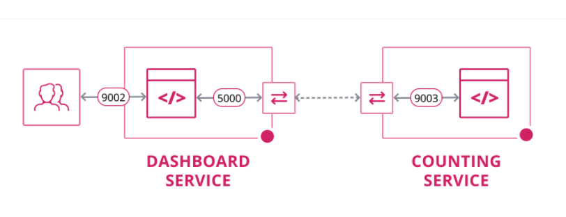
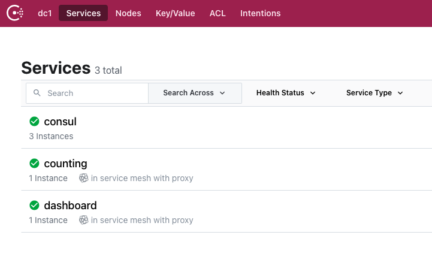

# Consul - Service Mesh

This example is used to practice and understand:

* Consul Connect (Service Mesh)
* ACL's

This example leverages the learn.hashicorp example of [Secure Service Communication with Consul Service Mesh and Envoy](https://learn.hashicorp.com/tutorials/consul/service-mesh-with-envoy-proxy?in=consul/developer-mesh)



## Requirements

* Vagrant

```bash
brew tap hashicorp/tap
brew install hashicorp/tap/vagrant
```

* [Oracle Virtual Box](https://www.virtualbox.org/wiki/Downloads)

## To Start

To spin up 3 node cluster consul cluster and 2 servers with Envoy enabled as the sidecar proxy.

```bash
sudo vagrant up
```

Consul cluster UI = http://192.168.99.100:8500/

## SSH  commands to boxes

``` bash
sudo vagrant ssh consul-server
# or
sudo vagrant ssh consul-node-1
# or 
sudo vagrant ssh consul-node-2
# or 
sudo vagrant ssh counting-1
# or 
sudo vagrant ssh dashboard-1
```



### Bootstrap ACL

SSH onto the `consul-server`

```bash
sudo vagrant ssh consul-server
```

Reconfigure the Consul Agent configuration file to enable Consul ACLs with `sudo vi /etc/consul.d/config.hcl`

```json
.....
"acl": {
    "enabled": true,
    "default_policy": "allow",
     "down_policy": "extend-cache"
    },
```

Restart the consul server to pick up the new configuration `sudo systemctl restart consul`

Run the bootstrap ACL command `consul acl bootstrap`

The below output should provide bootstrap/master token that has the global-management policy, as an example below:

```bash
AccessorID:       b5560187-c2b9-8d02-0d5c-a35efbb32280
SecretID:         78d70448-16ff-5f8c-9042-a3efd2b2e870
Description:      Bootstrap Token (Global Management)
Local:            false
Create Time:      2021-05-16 13:32:43.016004687 +0000 UTC
Policies:
   00000000-0000-0000-0000-000000000001 - global-management
```


## To Stop

```bash
sudo vagrant down
```