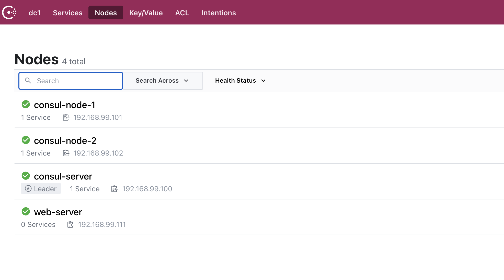

# HashiCorp - related projects

## Consul
Spin up 3 node cluster + consul agent

### To Start

```bash
sudo vagrant up
```

Consul cluster UI = http://192.168.99.100:8500/

## To SSH

``` bash
sudo vagrant ssh consul-server

# or

sudo vagrant ssh consul-node-1

# or 

sudo vagrant ssh consul-node-2

# or 

sudo vagrant ssh web-server
```



### To Stop

```bash
sudo vagrant down
```

## Nomad
