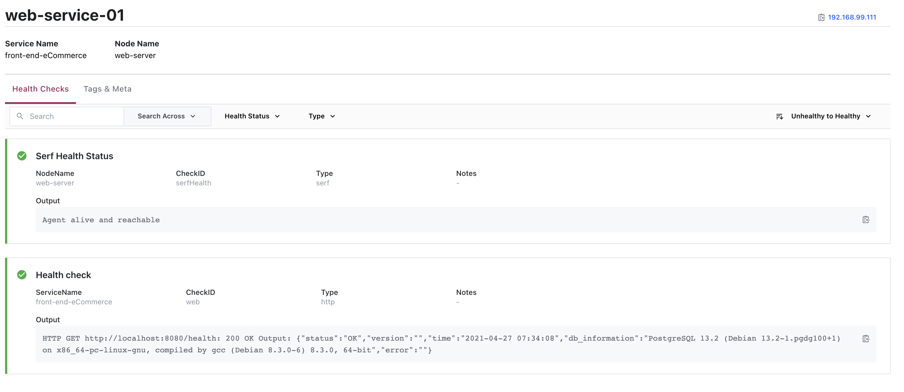

# HashiCorp - related projects

## Consul

I used this repo to practice spinning up and configuring using HashiCorp Consul with [Getting Started with HashiCorp Consul 2021 from Bryan Krausen](https://www.udemy.com/course/hashicorp-consul/?referralCode=6506321DC305903E7BFA)

### To Start

To spin up 3 node cluster and "web server" node.
The web server has a web api with the sole function to connect to the Postgres database

```bash
sudo vagrant up
```

Consul cluster UI = http://192.168.99.100:8500/

## To SSH

``` bash
sudo vagrant ssh consul-server

# or

sudo vagrant ssh consul-node-1

# or 

sudo vagrant ssh consul-node-2

# or 

sudo vagrant ssh web-server
```


The web-server `/health` endpoint responds with `200` if there is a successful connection to the Postgres database (all in docker). 
Expected response example:

```json
{
  "status": "OK",
  "version": "0.1.0-local",
  "time": "2021-02-15 07:36:02",
  "db_information": "PostgreSQL 13.1 (Debian 13.1-1.pgdg100+1) on x86_64-pc-linux-gnu, compiled by gcc (Debian 8.3.0-6) 8.3.0, 64-bit",
  "error": ""
}
```


### To Stop

```bash
sudo vagrant down
```

## Nomad

_coming soon_

## vault

_coming soon_